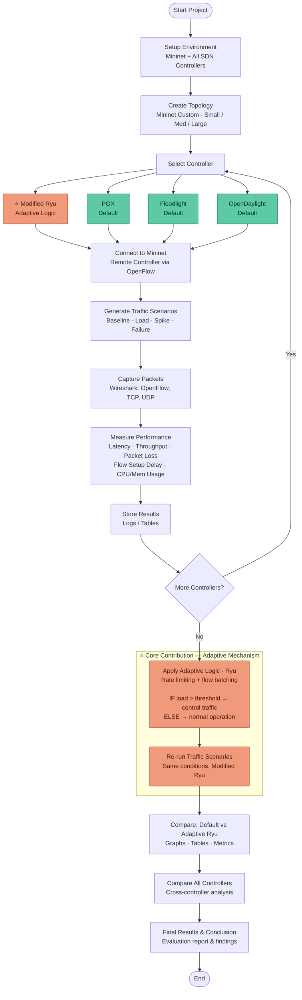

---

# 🎯 1. Title Slide

* Project Title
* Your Name
* Program (MSc in Information & Cyber Security)
* Supervisor Name
* Date

---

# 🧭 2. Motivation & Background

* What is SDN (1–2 lines)
* Role of controllers (control plane separation)
* Problem with current evaluations:

  * Mostly static conditions
  * Not realistic

👉 Goal: Show *why this research matters*

---

# ❗ 3. Problem Statement

* Existing studies:

  * Focus on stable networks
* Real-world networks:

  * Dynamic traffic
  * Failures
  * Congestion

**Key gap:**

> Lack of performance evaluation under dynamic conditions + lack of adaptive handling

---

# 🎯 4. Research Objectives

* Analyze and compare the performance of multiple open-source SDN controllers (Ryu, POX, Floodlight/OpenDaylight).
* Implement SDN network topologies using Mininet.
* Evaluate controller efficiency based on:

  * Latency(RTT)
  * Throughput
  * Packet loss
  * Flow setup time
* Monitor ICMP,TCP Packet ,UDP Packet OpenFlow traffic using Wireshark. 
* Identify the most suitable controller for scalable and efficient network environments.

---

# 💡 5. Proposed Approach (High-Level Flow)

Use a diagram if possible.

Flow:

1. Setup SDN environment
2. Deploy controllers
3. Generate traffic scenarios
4. Collect metrics
5. Apply adaptive logic (Ryu)
6. Re-evaluate & compare

---

# 🧱 6. System Design




## Controllers Evaluated

| Controller | Type | Notes |
|---|---|---|
| **Modified Ryu ⭐** | Adaptive | Rate limiting + flow batching — original contribution |
| POX | Baseline | Default OpenFlow controller |
| Floodlight | Baseline | Default OpenFlow controller |
| OpenDaylight | Baseline | Default OpenFlow controller |

## Performance Metrics

| Metric | Tool | Protocol |
|---|---|---|
| Latency | ping | ICMP |
| Throughput | iperf | TCP |
| Packet Loss | iperf | UDP |
| Flow Setup Delay | Wireshark | OpenFlow |
| CPU / Memory Usage | system stats | — |
# ⚙️ 7. Experimental Design

* Same topology for fairness
* Multiple scales:

  * Small
  * Medium
  * Large

---

# 🧪 8. Test Scenarios

One slide, structured:

* Baseline (normal traffic)
* Increasing load
* Traffic spike / congestion
* Link failure
* Adaptive controller test

---

# 🔧 9. Adaptive Mechanism (Core Contribution)

Explain clearly:

* Problem: too many packet-in requests
* Solution:

  * Rate limiting
  * Flow batching

Show pseudo-logic:

```
IF load > threshold → control traffic
ELSE → normal operation
```

👉 This slide is **critical** — this is your originality

---

# 📊 10. Performance Metrics

* Latency
* Throughput
* Packet loss
* Flow setup time
* Recovery time
* CPU / Memory usage

---

# 📈 11. Evaluation Plan

* Compare:

  * Controller vs Controller
  * Default Ryu vs Modified Ryu

* Visualization:

  * Graphs
  * Tables

---

# 🧾 12. Expected Results

* Performance degradation under stress
* Differences between controllers
* Improved efficiency with adaptive Ryu

👉 Keep realistic, not exaggerated

---

# 🗺️ 13. Work Plan / Timeline

Break into phases:

1. Literature Review
2. Environment Setup
3. Controller Integration
4. Scenario Implementation
5. Adaptive Logic Development
6. Testing & Data Collection
7. Analysis & Writing

---

# ⚠️ 14. Challenges & Risks

* Tool compatibility issues
* Controller setup complexity
* Accurate metric collection
* Resource limitations (VM performance)

👉 This shows maturity

---

# 🏁 15. Conclusion

* Restate:

  * What you will do
  * Why it matters
  * Expected contribution

---

# 🎤 16. Q&A Slide

Simple:

> “Thank You — Questions?”

---


