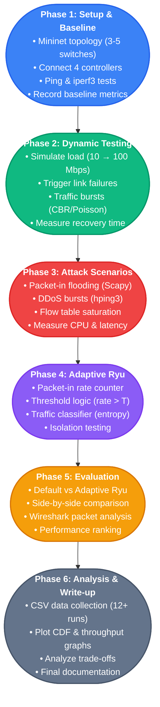

---

# SDN Controller Performance & Security Testing Methodology

## Overview
This research follows a structured 6-phase approach to evaluate SDN controllers (Ryu, POX, Floodlight, OpenDaylight) under normal, dynamic, and adversarial conditions, then develop and test an adaptive security mechanism.

*(...rest of your markdown text continues below...)*
# SDN Controller Performance & Security Testing Methodology

## Overview
This research follows a structured 6-phase approach to evaluate SDN controllers (Ryu, POX, Floodlight, OpenDaylight) under normal, dynamic, and adversarial conditions, then develop and test an adaptive security mechanism.

---

## Phase 1 — Environment Setup & Baseline Testing

### Objectives
Establish testing environment and collect baseline performance metrics for each controller.

### Tasks
1. **Write Mininet Topology Script**
   - Create topology with 3-5 switches and 4-6 hosts
   - Ensure proper connectivity between all nodes

2. **Connect Controllers Sequentially**
   - Test each controller one at a time:
     - Ryu
     - POX
     - Floodlight
     - OpenDaylight

3. **Run Basic Connectivity Tests**
   - Execute ping tests between hosts
   - Run iperf3 tests for throughput validation
   - Confirm each controller functions correctly

4. **Record Baseline Metrics**
   - Latency measurements
   - Throughput capacity
   - Packet loss percentage
   - Document results per controller

### Tools
- Mininet (topology)
- iperf3 (throughput testing)
- ping (connectivity)

---

## Phase 2 — Dynamic Network Condition Testing

### Objectives
Evaluate controller performance under varying network conditions and stress.

### Tasks
5. **Simulate Increasing Load**
   - Use iperf3 with stepped bandwidth:
     - 10 Mbps → 50 Mbps → 100 Mbps
   - Monitor controller response at each level

6. **Trigger Link Failures**
   - Use Mininet's `link down` command mid-test
   - Observe controller reaction to topology changes
   - Measure recovery behavior

7. **Generate Traffic Bursts**
   - Implement CBR (Constant Bit Rate) model
   - Implement Poisson traffic model
   - Use D-ITG or hping3 for traffic generation

8. **Measure Performance Metrics**
   - Flow setup time
   - Network recovery time
   - Throughput degradation per controller
   - Document variations across controllers

### Tools
- iperf3 (load testing)
- Mininet link commands (failure simulation)
- D-ITG / hping3 (traffic bursts)

---

## Phase 3 — Adversarial / Attack Scenario Testing

### Objectives
Assess controller resilience and security under various attack scenarios.

### Tasks
9. **Simulate Packet-In Flooding**
   - Craft spoofed packets using Scapy
   - Overwhelm controller with malicious packet-in messages
   - Measure controller degradation

10. **Simulate DDoS Traffic Bursts**
    - Deploy multiple hosts to flood target
    - Use hping3 or iperf3 UDP floods
    - Observe controller handling of distributed attacks

11. **Generate Malicious Random Flows**
    - Create random flow patterns to saturate flow tables
    - Test controller memory and processing limits
    - Measure flow table exhaustion impact

12. **Measure Security Metrics**
    - CPU usage under attack
    - Control-plane latency
    - Packet loss rates
    - Throughput under each attack scenario
    - Compare resilience across all controllers

### Tools
- Scapy (packet crafting)
- hping3 / iperf3 UDP (DDoS simulation)
- System monitoring tools (CPU, latency)

---

## Phase 4 — Build Adaptive Ryu Mechanism

### Objectives
Develop an adaptive security mechanism for the Ryu controller to detect and mitigate attacks.

### Tasks
13. **Implement Packet-In Rate Counter**
    - Add rate counter to Ryu application
    - Use sliding time window for measurement
    - Track packet-in message frequency

14. **Implement Threshold Logic**
    - Define threshold T for normal operation
    - If rate > T:
      - Activate rate-limiting
      - Deprioritize suspicious flows
    - Configure automatic response triggers

15. **Add Traffic Classifier**
    - Distinguish legitimate vs anomalous flows
    - Use IP/port entropy analysis
    - Implement classification algorithms
    - Flag suspicious traffic patterns

16. **Test Modified Ryu in Isolation**
    - Deploy adaptive Ryu mechanism
    - Verify mechanism triggers correctly
    - Validate rate-limiting functionality
    - Test traffic classification accuracy

### Tools
- Python (Ryu application development)
- Ryu framework
- Custom entropy calculation algorithms

---

## Phase 5 — Comparative Evaluation

### Objectives
Compare adaptive Ryu against default Ryu and other controllers across all scenarios.

### Tasks
17. **Repeat Dynamic & Attack Tests**
    - Re-run Phase 2 tests with adaptive Ryu
    - Re-run Phase 3 tests with adaptive Ryu
    - Maintain same topology and traffic patterns
    - Ensure fair comparison conditions

18. **Compare Default vs Adaptive Ryu**
    - Analyze latency improvements
    - Measure throughput differences
    - Compare CPU usage
    - Evaluate recovery time enhancements

19. **Side-by-Side Controller Comparison**
    - Compare all 4 controllers:
      - Default Ryu
      - Adaptive Ryu
      - POX
      - Floodlight
      - OpenDaylight
    - Test across all dynamic scenarios
    - Test across all attack scenarios
    - Rank performance and security

20. **Detailed Packet-Level Analysis**
    - Use Wireshark for packet capture
    - Analyze OpenFlow statistics
    - Examine flow table behavior
    - Document protocol-level differences

### Tools
- Wireshark (packet analysis)
- OpenFlow statistics
- Performance monitoring tools

---

## Phase 6 — Data Collection, Analysis & Write-Up

### Objectives
Consolidate findings, perform statistical analysis, and document results.

### Tasks
21. **Collect All Metrics**
    - Organize data into CSV format
    - Structure: per-controller, per-scenario
    - Include 12+ experiment runs
    - Ensure data integrity and completeness

22. **Plot Analysis Graphs**
    - CDF (Cumulative Distribution Function) of latency
    - Throughput vs load graphs
    - CPU usage under attack visualizations
    - Recovery time bar charts
    - Comparative performance charts

23. **Analyze Trade-Offs**
    - Evaluate scalability vs security
    - Assess performance vs protection
    - Compare per-controller characteristics
    - Identify optimal use cases for each controller

24. **Write Research Documentation**
    - Results section with findings
    - Discussion of implications
    - Conclusion with recommendations
    - Future work suggestions

### Tools
- CSV/data organization
- matplotlib / pandas (analysis & plotting)
- Statistical analysis tools

---

## Technology Stack Summary

| Category | Tools |
|----------|-------|
| **Topology & Traffic Simulation** | Mininet |
| **Throughput Testing** | iperf3 |
| **Traffic Generation & Attack Simulation** | hping3, Scapy, D-ITG |
| **Packet Capture & Analysis** | tcpdump, Wireshark |
| **Adaptive Mechanism Development** | Python (Ryu app) |
| **Analysis & Plotting** | matplotlib, pandas |
| **Controllers Tested** | Ryu, POX, Floodlight, OpenDaylight |

---

## Expected Outcomes

1. **Performance Baselines** for each controller under normal conditions
2. **Resilience Metrics** showing controller behavior under stress
3. **Security Assessment** identifying vulnerabilities and strengths
4. **Adaptive Mechanism** demonstrating improved attack resistance
5. **Comparative Analysis** providing clear controller recommendations
6. **Research Publication** with comprehensive findings and methodology

---

## Timeline Estimate

- **Phase 1:** 1-2 weeks
- **Phase 2:** 2-3 weeks
- **Phase 3:** 2-3 weeks
- **Phase 4:** 3-4 weeks
- **Phase 5:** 2-3 weeks
- **Phase 6:** 2-3 weeks

**Total Duration:** ~12-18 weeks

---

## Success Criteria

✅ All 4 controllers tested under identical conditions  
✅ Adaptive mechanism successfully mitigates attacks  
✅ Comprehensive data collected for all scenarios  
✅ Statistical significance achieved (12+ runs per test)  
✅ Clear performance and security comparisons documented  
✅ Reproducible methodology for future research

