# Adaptive SDN Controller Testing Framework

## Project Overview
This project evaluates and enhances SDN (Software Defined Networking) controllers' resilience to network attacks and dynamic conditions. We develop an adaptive mechanism for the Ryu controller to detect and mitigate packet-in flooding attacks while maintaining performance.

---

## Project Flow Diagram

```mermaid
graph TD
    A["<b>Phase 1: Environment Setup & Baseline Testing</b><br/>1. Write Mininet topology script<br/>2. Connect controllers: Ryu → POX → Floodlight → OpenDaylight<br/>3. Run ping & iperf3 tests<br/>4. Record baseline metrics"] -->|Success| B

    B["<b>Phase 2: Dynamic Network Condition Testing</b><br/>5. Simulate increasing load 10-100 Mbps<br/>6. Trigger link failures mid-test<br/>7. Generate traffic bursts CBR+Poisson<br/>8. Measure flow setup & recovery time"] -->|Data Collected| C

    C["<b>Phase 3: Adversarial/Attack Scenario Testing</b><br/>9. Simulate packet-in flooding with Scapy<br/>10. Simulate DDoS with hping3/iperf3<br/>11. Generate malicious random flows<br/>12. Measure CPU, latency, packet loss"] -->|Attacks Tested| D

    D["<b>Phase 4: Build Adaptive Ryu Mechanism</b><br/>13. Add packet-in rate counter<br/>14. Implement threshold logic & rate-limit<br/>15. Add traffic classifier<br/>16. Test in isolation"] -->|Mechanism Ready| E

    E["<b>Phase 5: Comparative Evaluation</b><br/>17. Repeat Phase 2&3 with adaptive Ryu<br/>18. Compare default vs adaptive Ryu<br/>19. Compare all 4 controllers side-by-side<br/>20. Wireshark/OpenFlow packet analysis"] -->|Results Ready| F

    F["<b>Phase 6: Data Collection, Analysis & Write-up</b><br/>21. Collect metrics into CSV 12+ runs<br/>22. Plot CDF, throughput, CPU graphs<br/>23. Analyze scalability vs security trade-offs<br/>24. Write results & conclusions"]

    style A fill:#4A90E2,stroke:#2E5C8A,color:#fff
    style B fill:#52C41A,stroke:#389E0D,color:#fff
    style C fill:#FF7A45,stroke:#D4380D,color:#fff
    style D fill:#9254DE,stroke:#5B2C6F,color:#fff
    style E fill:#FF7A45,stroke:#D4380D,color:#fff
    style F fill:#8C8C8C,stroke:#595959,color:#fff
```



---

## Detailed Phase Breakdown

### Phase 1 — Environment Setup & Baseline Testing
Establish the testing environment and measure baseline performance for each controller.

- [ ] 1. Write a simple Mininet topology script (3–5 switches, 4–6 hosts)
- [ ] 2. Connect each controller one at a time: Ryu → POX → Floodlight → OpenDaylight
- [ ] 3. Run basic ping and iperf3 tests — confirm each controller works
- [ ] 4. Record baseline: latency, throughput, packet loss per controller

---

### Phase 2 — Dynamic Network Condition Testing
Simulate real-world network challenges including load increases, link failures, and traffic bursts.

- [ ] 5. Simulate increasing load using iperf3 with stepped bandwidth (10 → 50 → 100 Mbps)
- [ ] 6. Trigger link failures mid-test using Mininet's link down command
- [ ] 7. Generate traffic bursts (CBR + Poisson model) using D-ITG or hping3
- [ ] 8. Measure: flow setup time, recovery time, throughput degradation per controller

---

### Phase 3 — Adversarial / Attack Scenario Testing
Test controller resilience against security attacks including flooding, DDoS, and flow table saturation.

- [ ] 9. Simulate packet-in flooding: craft spoofed packets using Scapy to overwhelm controller
- [ ] 10. Simulate DDoS traffic bursts: multiple hosts flood a target with hping3 or iperf3 UDP
- [ ] 11. Generate malicious random flows to saturate flow tables
- [ ] 12. Measure: CPU usage, control-plane latency, packet loss, throughput under each attack

---

### Phase 4 — Build Adaptive Ryu Mechanism
Develop and test a new adaptive mechanism for the Ryu controller to handle attacks.

- [ ] 13. In Ryu app: add a packet-in rate counter with a sliding time window
- [ ] 14. Implement threshold logic: if rate > T → rate-limit + deprioritize suspicious flows
- [ ] 15. Add traffic classifier: distinguish legitimate vs anomalous flows by IP/port entropy
- [ ] 16. Test modified Ryu in isolation — verify the mechanism triggers correctly

---

### Phase 5 — Comparative Evaluation
Re-run all dynamic and attack scenario tests to compare the adaptive Ryu with baseline controllers.

- [ ] 17. Repeat Phase 2 and Phase 3 tests with adaptive Ryu — same topology, same traffic
- [ ] 18. Compare default Ryu vs adaptive Ryu: latency, throughput, CPU, recovery time
- [ ] 19. Compare all 4 controllers side-by-side across all dynamic and attack scenarios
- [ ] 20. Use Wireshark / OpenFlow stats for detailed packet-level analysis

---

### Phase 6 — Data Collection, Analysis & Write-up
Compile, analyze, and present results in a comprehensive report.

- [ ] 21. Collect all metrics into CSV: per-controller, per-scenario (12+ experiment runs)
- [ ] 22. Plot graphs: CDF of latency, throughput vs load, CPU under attack, recovery time bars
- [ ] 23. Analyze trade-offs: scalability vs security vs performance per controller
- [ ] 24. Write results, discussion, and conclusion sections

---

## Tools & Technologies

| Category | Tools |
|----------|-------|
| **Network Simulation** | Mininet |
| **Traffic Generation & Attack** | iperf3, hping3, Scapy, D-ITG |
| **Packet Capture & Analysis** | Wireshark, tcpdump |
| **Adaptive Mechanism** | Python (Ryu app) |
| **Data Analysis & Visualization** | matplotlib, pandas |

---

## Progress Tracking

| Phase | Status | Completion |
|-------|--------|-----------|
| Phase 1 - Environment Setup | ⭕ Not Started | 0% |
| Phase 2 - Dynamic Testing | ⭕ Not Started | 0% |
| Phase 3 - Attack Scenarios | ⭕ Not Started | 0% |
| Phase 4 - Adaptive Mechanism | ⭕ Not Started | 0% |
| Phase 5 - Evaluation | ⭕ Not Started | 0% |
| Phase 6 - Analysis & Write-up | ⭕ Not Started | 0% |

---

## Key Milestones

- **Milestone 1**: Environment setup complete and baseline metrics recorded (after Phase 1)
- **Milestone 2**: All test scenarios developed and initial results collected (after Phase 3)
- **Milestone 3**: Adaptive mechanism implemented and tested (after Phase 4)
- **Milestone 4**: Comparative analysis complete (after Phase 5)
- **Milestone 5**: Final report and documentation ready (after Phase 6)

---

## Repository Structure

```
project-root/
├── mininet/                 # Topology scripts
├── tests/                   # Test scripts & scenarios
├── ryu_app/                 # Adaptive Ryu application
├── results/                 # Experimental data & CSV files
├── analysis/                # Analysis & plotting scripts
├── README.md                # This file
└── requirements.txt         # Python dependencies
```

---

## Getting Started

### Prerequisites

```bash
# Install Mininet
sudo apt-get install mininet

# Install Python dependencies
pip install -r requirements.txt

# Install network tools
sudo apt-get install iperf3 hping3 scapy tcpdump wireshark
```

### Running the Project

1. Start with Phase 1 to set up the environment
2. Follow the checklist in each phase
3. Document results in the `/results/` directory
4. Use Phase 6 scripts for analysis and visualization

---

## Notes

- Update the progress table as you complete each phase
- Keep all experimental data in CSV format for easy analysis
- Document any deviations from the original plan
- Share results and challenges with collaborators regularly

---

*Last Updated: June 2026*

---

## Tools & Technologies

| Category | Tools |
|----------|-------|
| **Network Simulation** | Mininet |
| **Traffic Generation & Attack** | iperf3, hping3, Scapy, D-ITG |
| **Packet Capture & Analysis** | Wireshark, tcpdump |
| **Adaptive Mechanism** | Python (Ryu app) |
| **Data Analysis & Visualization** | matplotlib, pandas |

---

## Progress Tracking

| Phase | Status | Completion |
|-------|--------|-----------|
| Phase 1 - Environment Setup | ⭕ Not Started | 0% |
| Phase 2 - Dynamic Testing | ⭕ Not Started | 0% |
| Phase 3 - Attack Scenarios | ⭕ Not Started | 0% |
| Phase 4 - Adaptive Mechanism | ⭕ Not Started | 0% |
| Phase 5 - Evaluation | ⭕ Not Started | 0% |
| Phase 6 - Analysis & Write-up | ⭕ Not Started | 0% |

---

## Key Milestones

- **Milestone 1**: Environment setup complete and baseline metrics recorded (after Phase 1)
- **Milestone 2**: All test scenarios developed and initial results collected (after Phase 3)
- **Milestone 3**: Adaptive mechanism implemented and tested (after Phase 4)
- **Milestone 4**: Comparative analysis complete (after Phase 5)
- **Milestone 5**: Final report and documentation ready (after Phase 6)

---

## Documentation

- **Topology Scripts**: `/mininet/`
- **Test Scripts**: `/tests/`
- **Ryu Application**: `/ryu_app/`
- **Data & Results**: `/results/`
- **Analysis Scripts**: `/analysis/`

---

## Getting Started

### Prerequisites
```bash
# Install Mininet
sudo apt-get install mininet

# Install Python dependencies
pip install -r requirements.txt

# Install network tools
sudo apt-get install iperf3 hping3 scapy tcpdump wireshark
```

### Running the Project
1. Start with Phase 1 to set up the environment
2. Follow the checklist in each phase
3. Document results in the `/results/` directory
4. Use Phase 6 scripts for analysis and visualization

---

## Notes

- Update the progress table as you complete each phase
- Keep all experimental data in CSV format for easy analysis
- Document any deviations from the original plan in this file
- Share results and challenges with collaborators regularly

---

*Last Updated: 2026*
